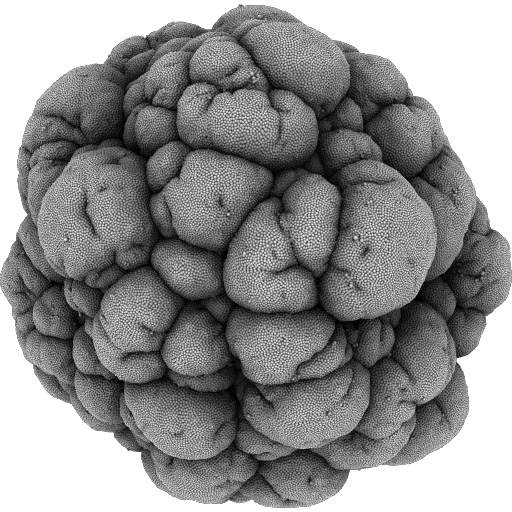
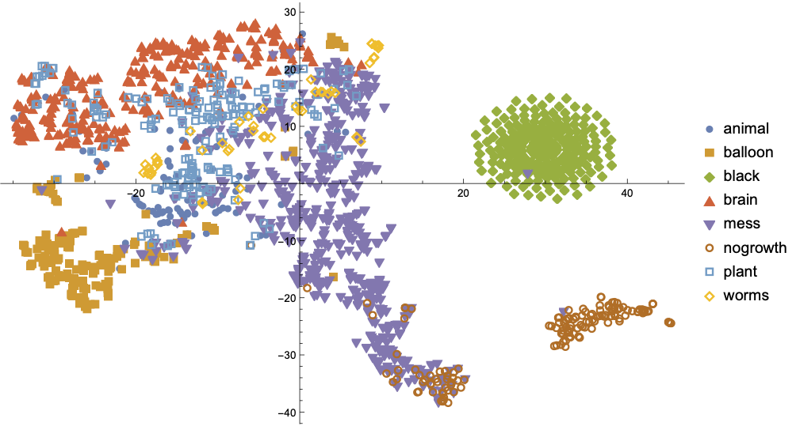

# Andy Lomas Generative Art Dataset (ALGAD) V1.0

Repository of a generative art dataset by computer artist Andy Lomas.

This repository contains a collection of 1,774 images created by computational artist [Andy Lomas](http://www.andylomas.com/).
The images were created using a customised cell growth model developed by the Artist [[1](#references)].
Forms were evolved using Lomas' *Species Explorer* software [[2](#references)].
In addition to the images, a csv file contains information on the parameters used to generate each form, along with an artist-assigned aesthetic ranking (0-10) and categorisation.

This dataset is provided for research purposes under the Creative Commons Attribution-NonCommercial-ShareAlike 4.0 International License. To view a copy of this license, visit http://creativecommons.org/licenses/by-nc-sa/4.0/ or send a letter to Creative Commons, PO Box 1866, Mountain View, CA 94042, USA.

For more information on the dataset, please see the following papers:

Jon McCormack and Andy Lomas, "Deep Learning of Individual Aesthetics", *Neural Computing and Applications*, (to appear), 2021.

Jon McCormack and Andy Lomas, Understanding Aesthetic Evaluation using Deep Learning, In: Romero J., et al.(eds) *Artificial Intelligence in Music, Sound, Art and Design.* EvoMUSART 2020. LNCS vol 12103. Springer, Cham (2020), [Paper on arxiv](https://arxiv.org/abs/2004.06874)

Thank you

Jon McCormack and Andy Lomas

## Database format
The database is supplied as a single csv file (*Lomas Dataset.csv*), the first line is the column labels, the remaining lines are the data. Here is an explanation of the labeled columns:

Column Label | Description 
------------ | -------------
uid | Unique identifier
fileName | file name of the image associated with this entry
score | artist assigned score (0-10)
category | artist assigned category
planarFactor | developmental gene parameter 1
springFactor | developmental gene parameter 2
bulgeFactor | developmental gene parameter 3
shortSplitFactor | developmental gene parameter 4
bendSplitFactor | developmental gene parameter 5
colinearSplitFactor | developmental gene parameter 6
opositeEdgeFactor | developmental gene parameter 7
randomSplitFactor | developmental gene parameter 8
collisionRadius | developmental gene parameter 9
collisionStrength | developmental gene parameter 10
foodIncMin | developmental gene parameter 11
foodIncRand | developmental gene parameter 12

### Categories
There are 8 artist-assigned categories for each image. Categories represent the general visual class discovered through exploration of the generative system.

Category | Number of Images
------------ | -------------
brain | 317
mess | 539
nogrowth | 154
ballon | 169
animal | 104
black | 251
worms | 53
plant | 187

Here is a visual map of each category in phenotype space. The image is dimensionally reduced from 2048 features to the 2D point in the plot using the t-SNE algorithm:

 

## Images
The images are in the Image directory, the names correspond to those in the dataset csv file.

`imageThumbs.tgz` contains thumbnail (128x128) versions of all the images.

The original images are too big to be stored on Github so can be downloaded from [this link](https://drive.google.com/drive/folders/1JyzATmpVSVD59dXsUd7LhhV0EKtIVivH?usp=sharing).

## References
[1] Lomas, A.: Cellular forms: An artistic exploration of morphogenesis. In: *AISB 2014 - 50th Annual Convention of the AISB* (2014)

[2] Lomas, A.: Species explorer: An interface for artistic exploration of multi-dimensional parameter spaces.   In: J. Bowen, N. Lambert, G. Diprose (eds.) *Electronic Visualisation and the Arts (EVA2016)*, Electronic Workshops in Computing (eWiC). BCS Learning and Development Ltd., London (2016)
